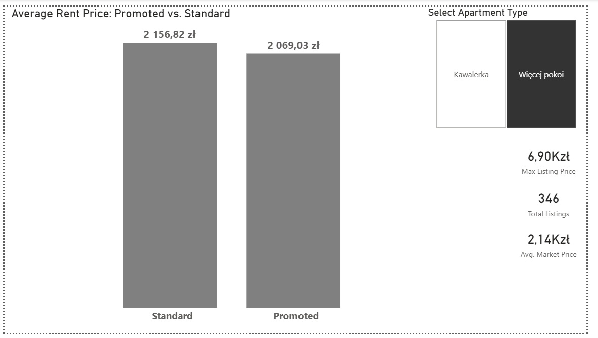

# Analiza Rynku Nieruchomości w Łodzi / Łódź Real Estate Market Analysis

---

### 🌐 Language / Język
* [English Version](#english-version)
* [Wersja Polska](#wersja-polska)

---

## English Version

### 📌 Project Overview
An end-to-end data analytics project investigating the correlation between ad promotion and rental prices in Łódź, Poland. The project handles the entire data pipeline: from custom web scraping to relational database queries and business intelligence visualization.

### 🛠️ Tech Stack
* **Python**: BeautifulSoup (Web Scraping), Pandas (ETL & Outlier Detection)
* **SQL (SQLite)**: Data aggregation and validation
* **Power BI**: Interactive dashboard design and business insights

### 📊 Key Insights
* **Hypothesis Debunked**: Standard listings actually maintain a higher average price (2,157 PLN) compared to promoted ones (2,069 PLN).
* **Market Behavior**: The lower-to-mid price segment is highly competitive, forcing landlords of cheaper properties to pay for promotions. Premium listings rarely use paid promotions as niche clients find them regardless.
* **Data Quality**: Identified and filtered extreme outliers (e.g., commercial properties listed at 25,000 PLN) that initially skewed the market average by 15%.

### 📷 Dashboard Preview

---

## Wersja Polska

### 📌 O projekcie
Kompleksowy projekt analityczny badający korelację między promowaniem ogłoszeń a cenami wynajmu mieszkań w Łodzi. Projekt obejmuje pełną ścieżkę danych (End-to-End): od zaawansowanego web scrapingu, przez czyszczenie danych i zapytania SQL, aż po biznesową wizualizację.

### 🛠️ Stos technologiczny
* **Python**: BeautifulSoup (Pobieranie danych), Pandas (ETL i usuwanie anomalii)
* **SQL (SQLite)**: Agregacja danych i weryfikacja hipotez rynkowych
* **Power BI**: Projektowanie interaktywnego dashboardu i wnioskowanie biznesowe

### 📊 Kluczowe wnioski
* **Obalenie hipotezy**: Wbrew intuicji, oferty zwykłe mają wyższą średnią cenę (2157 PLN) niż oferty promowane (2069 PLN).
* **Zachowanie rynku**: Segment tańszych mieszkań jest niezwykle konkurencyjny, co zmusza właścicieli do dopłacania za promowanie. Droższe apartamenty rzadko korzystają z płatnych wyróżnień, ponieważ docelowy klient i tak je znajdzie.
* **Jakość danych**: Zidentyfikowano i odfiltrowano skrajne wartości odstające (np. lokale komercyjne za 25 000 PLN), które bez oczyszczenia sztucznie zawyżały średnią rynkową o 15%.

### 📷 Widok Dashboardu
